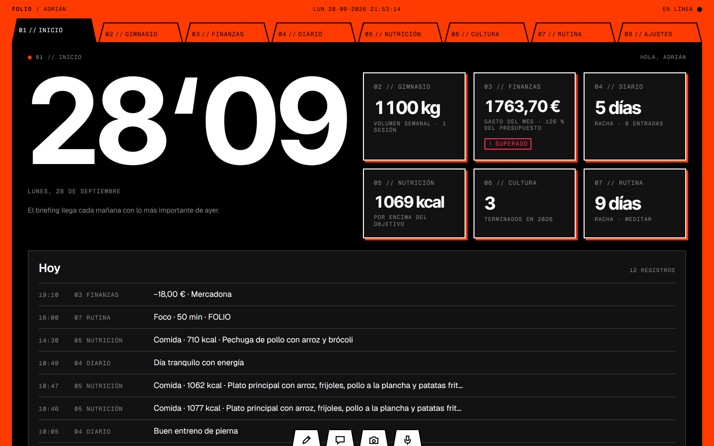
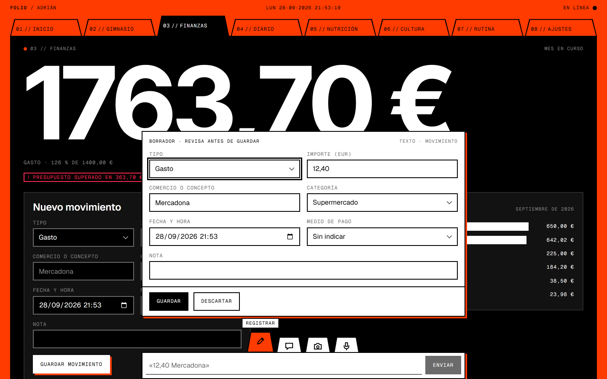
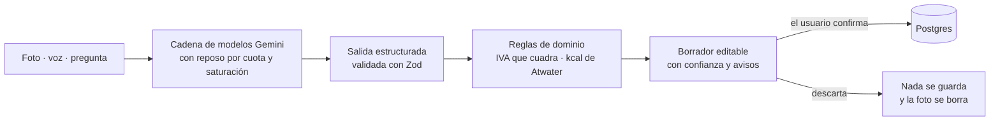
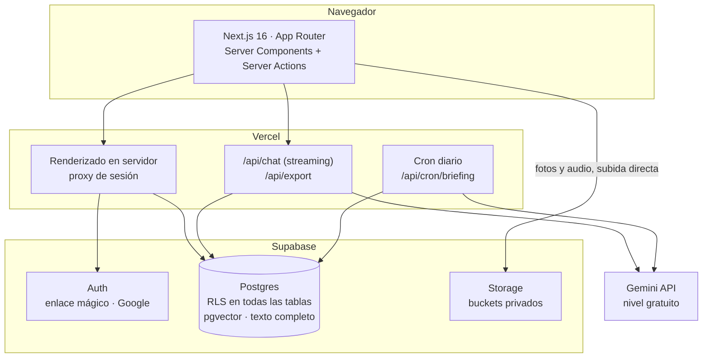
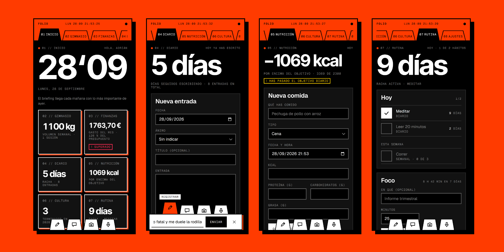
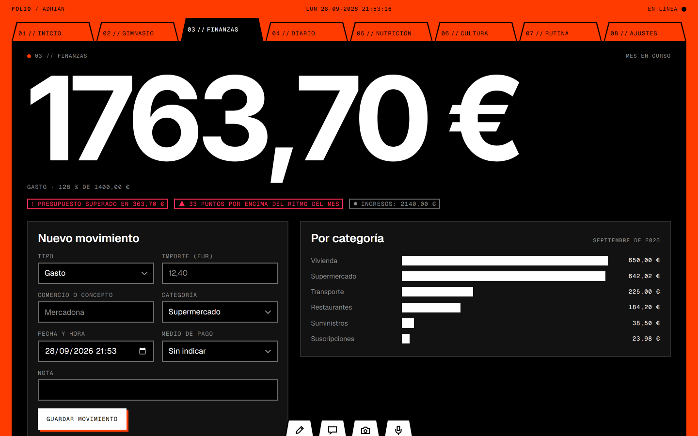
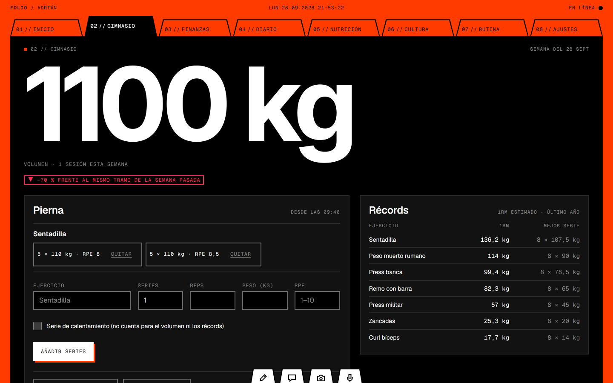

<div align="center">


# FOLIO

**Un sistema operativo personal con forma de archivador.**<br>
Ocho áreas de tu vida en una sola carpeta. Registrar cuesta un gesto; la IA propone y tú confirmas.

[](https://github.com/Adriiiii24/FOLIO/actions/workflows/ci.yml)


[Qué es](#qué-es) · [Las ocho carpetas](#las-ocho-carpetas) · [IA](#ia-que-propone-y-no-escribe-sola) · [Arquitectura](#arquitectura) · [Puesta en marcha](#puesta-en-marcha) · [Documentación](#documentación)

<br>



<sub>Capturas de la cuenta de demostración, con datos sintéticos.</sub>

</div>

---

## Qué es

La vida cuantificada está repartida entre apps que no se hablan: el gasto en _delivery_ vive lejos del diario donde se anotó el cansancio, y preguntar «¿entreno peor las semanas que duermo mal?» exige exportar y cruzar a mano.

FOLIO junta **entreno, dinero, diario, nutrición, consumo cultural, hábitos y foco** en una sola base de datos, con una pestaña por área y una cifra protagonista por lámina. Una IA multimodal hace que registrar cueste una frase, una foto o una nota de voz, y responde preguntas que cruzan áreas con la evidencia a la vista.

Tres principios guían cada decisión:

|       | Principio                         | En la práctica                                                                                                                                                                          |
| ----- | --------------------------------- | --------------------------------------------------------------------------------------------------------------------------------------------------------------------------------------- |
| **1** | **La IA propone y tú confirmas**  | Ninguna salida de un modelo se guarda sin pasar por un borrador visible y editable. En datos de dinero y salud, un error silencioso cuesta más que un toque de confirmación.            |
| **2** | **Un gesto para registrar**       | La acción más frecuente es la más barata. Donde basta un conmutador explícito, no se gasta una llamada de IA en adivinar la intención.                                                  |
| **3** | **Las cifras salen de los datos** | El briefing de cada mañana calcula sus números en SQL; el modelo solo redacta alrededor de marcadores validados. Un número que el modelo no escribe es un número que no puede inventar. |

## Las ocho carpetas

|      | Carpeta       | Para qué sirve                                         | Cifra protagonista        | Entrada con IA                       |
| ---- | ------------- | ------------------------------------------------------ | ------------------------- | ------------------------------------ |
| `01` | **Inicio**    | Responder «¿cómo voy hoy?» en un vistazo               | La fecha, a tamaño cartel | Briefing diario, chat                |
| `02` | **Gimnasio**  | Registrar entre serie y serie y ver la progresión real | Volumen semanal (kg)      | Voz → series                         |
| `03` | **Finanzas**  | Saber a dónde va el dinero                             | Gasto del mes             | Foto del ticket, con desglose de IVA |
| `04` | **Diario**    | Un diario consultable por significado                  | Racha de escritura        | Nota de voz, búsqueda semántica      |
| `05` | **Nutrición** | Kcal y macros sin pesar cada alimento                  | Kcal restantes hoy        | Foto del plato, texto                |
| `06` | **Cultura**   | Lo que lees, ves, escuchas y juegas                    | Terminados este año       | Preguntas en el chat                 |
| `07` | **Rutina**    | Sostener hábitos y medir el trabajo profundo           | Racha activa              | Voz («hecho: meditar»)               |
| `08` | **Ajustes**   | Perfil, objetivos, IA, exportación y borrado           | Usos de IA de hoy         | —                                    |

Cada visitante tiene su propia cuenta, con enlace mágico o con Google, y sus datos aislados del resto.

## Registrar en un gesto



En el borde inferior de la pantalla esperan cuatro pestañas medio enterradas: **Registrar**, **Preguntar**, **Foto** y **Voz**. Cada una saca una ficha con una sola función.

- **Registrar:** «12,40 Mercadona» en Finanzas es un gasto; «press banca, 4 series de 8 a 80» en Gimnasio son cuatro series. La pestaña activa da el contexto y el texto se interpreta sin IA.
- **Buscar el alimento:** en Nutrición, escribes «pechuga de pollo» y salen sus kcal y macros, de 3.181 alimentos genéricos de CIQUAL. Tolera tildes, erratas y plurales, suma los gramos de cada alimento y guarda la lista como plato propio. Sin IA.
- **Foto:** el ticket o el plato se comprimen en el navegador, sin metadatos EXIF, y suben directos a Storage. El modelo devuelve un borrador con su confianza y sus avisos.
- **Voz:** transcripción literal y un borrador de diario, de series o de hábito. Si la nota menciona un gasto, FOLIO ofrece registrarlo después, de uno en uno.
- **Preguntar:** chat de solo lectura sobre tus propios datos, con la evidencia de cada cifra.

Nada se guarda hasta pulsar **Guardar**, y durante unos segundos se puede **deshacer**.

## IA que propone y no escribe sola

La IA es **gratuita**: todo funciona con el nivel gratuito de la Gemini API, a través del [AI SDK de Vercel](https://ai-sdk.dev).



- **Salidas estructuradas:** cada extracción se valida con un esquema Zod y con reglas del dominio. Un ticket cuyas bases e impuestos no suman el total, o un plato cuyas kcal no cuadran con sus macros, llega al borrador con el aviso.
- **Chat con herramientas tipadas, no _text-to-SQL_:** diez herramientas de solo lectura (gasto por categoría, progresión de un ejercicio, búsqueda en el diario…). Cada resultado se enseña como evidencia junto a la respuesta.
- **Búsqueda híbrida en el diario:** vectores (pgvector con índice HNSW) y texto completo en español sin tildes, fusionados con _Reciprocal Rank Fusion_. «camion» encuentra «camión», y la parte vectorial encuentra entradas que hablan de lo mismo con otras palabras. Los _embeddings_ se calculan después de responder, sin retrasar el guardado.
- **Briefing diario:** un cron genera cada mañana el resumen de ayer. Las cifras salen de SQL y el modelo escribe alrededor de marcadores `{{métrica}}` que se validan antes de publicar.
- **Cuota honesta:** el nivel gratuito limita las peticiones por modelo y por día. Cada ruta encadena varios modelos Gemini, deja en reposo los agotados y los saturados, y avisa con un mensaje claro si no queda ninguno. Cada cuenta tiene además un tope diario de usos (`AI_DAILY_LIMIT`).
- **Sin IA, todo sigue funcionando a mano:** los ocho módulos tienen su formulario completo.

## Arquitectura



- **Un solo Postgres** para lo relacional, lo vectorial y el texto completo: las preguntas que cruzan áreas son _joins_, no integraciones.
- **Server Components y Server Actions** para leer y escribir; las fotos y los audios no viajan por Server Actions, van directos a Storage.
- **El día es siempre el día local de cada persona** (`profiles.timezone`), nunca el del servidor: un hábito marcado a las 00:30 en Madrid cuenta para ese día.

## Seguridad y privacidad

- **Row Level Security en todas las tablas**, con 103 pruebas en pgTAP (aislamiento entre cuentas, catálogo de alimentos y platos) que la CI ejecuta en cada _push_. Las claves foráneas compuestas impiden referencias entre cuentas.
- **Buckets privados** para tickets, platos y notas de voz. Las fotos pierden sus metadatos EXIF antes de salir del navegador.
- **Secretos solo en el servidor.** La clave de servicio nunca lleva el prefijo `NEXT_PUBLIC_`, y el cron exige un `CRON_SECRET`.
- **Tus datos son tuyos:** exportación completa en JSON o en CSV por área, borrado de la cuenta en cascada y cierre de sesión en todos los dispositivos.
- **Nada del contenido es una instrucción:** lo que lee el OCR o lo que dicta una nota de voz nunca llega a herramientas que escriban.

## Diseño



Un archivador físico convertido en interfaz. Sobre una **mesa naranja** descansa una **carpeta negra** abierta, con una pestaña troquelada por área. Dentro, cada lámina tiene una sola cifra a tamaño cartel y fichas oscuras con lo archivado. El **papel blanco** aparece solo donde te toca escribir o decidir.

- **Suizo y brutalista:** esquinas vivas, bordes de 2 px, sombras duras sin desenfoque y etiquetas mono en mayúsculas. El naranja no decora: dentro de la carpeta significa «activo, foco o en vivo».
- **Movimiento con propósito ([Motion](https://motion.dev)):** la lámina entra por el lado de su pestaña con un muelle; las pestañas de entrada suben al señalarlas; la cifra rueda hasta su valor nuevo al guardar.
- **Accesibilidad WCAG 2.2 AA:** todo se maneja con teclado (`1`–`8` cambian de carpeta y `/` abre Registrar, atajos que se pueden desactivar). El foco siempre se ve y los controles miden al menos 44 × 44 px. La app respeta el movimiento reducido y los colores forzados, y ninguna señal de color va sin su glifo y su texto.

El sistema completo, con tokens, componentes y reglas, está en [`docs/DESIGN_SYSTEM.md`](docs/DESIGN_SYSTEM.md) y [`DESIGN.md`](DESIGN.md).

<table>
<tr>
<td width="50%"></td>
<td width="50%"></td>
</tr>
</table>

## Stack

| Capa         | Tecnología                                                          | Versión                 |
| ------------ | ------------------------------------------------------------------- | ----------------------- |
| Framework    | Next.js (App Router, Turbopack)                                     | 16.3.6                  |
| UI           | React · Tailwind CSS · Motion                                       | 19.3.0 · 4.3.3 · 13.4.4 |
| Lenguaje     | TypeScript en modo estricto                                         | 5.9.3                   |
| Datos y auth | Supabase: Postgres, RLS, Auth, Storage y pgvector (`@supabase/ssr`) | 0.12.7                  |
| IA           | AI SDK con el proveedor de Google                                   | 7.0.118 · 4.0.82        |
| Validación   | Zod                                                                 | 4.6.5                   |
| Pruebas      | Vitest · pgTAP (CLI de Supabase)                                    | 5.0.2 · 2.118.0         |
| Despliegue   | Vercel, con cron diario y Speed Insights                            | —                       |

Todas las dependencias van fijadas con versión exacta. El porqué de cada elección, con sus alternativas descartadas, está en [`docs/PROPOSAL.md`](docs/PROPOSAL.md) §4.

## Puesta en marcha

**Requisitos:** Node 24 con npm ≥ 11.17 y Docker Desktop en marcha.

```bash
# 1 · Dependencias
npm ci

# 2 · Supabase local: Postgres, Auth, Storage y Mailpit, con la migración aplicada
npm run db:start
npm run db:test        # 103 pruebas pgTAP: aislamiento RLS, catálogo y platos

# 3 · Variables de entorno (ver más abajo) y servidor de desarrollo
npm run dev            # http://localhost:3000
```

Los correos del enlace mágico llegan a Mailpit, en http://127.0.0.1:54324.

<details>
<summary><b>Variables de entorno</b></summary>

<br>

`.env.local` (no se versiona). Los valores locales de Supabase salen de `npx supabase status -o env`.

| Variable                               | Para qué                                                         |
| -------------------------------------- | ---------------------------------------------------------------- |
| `NEXT_PUBLIC_SUPABASE_URL`             | URL del proyecto de Supabase                                     |
| `NEXT_PUBLIC_SUPABASE_PUBLISHABLE_KEY` | Clave pública, sujeta a RLS                                      |
| `SUPABASE_SECRET_KEY`                  | Clave secreta, solo servidor (cron y tareas de fondo)            |
| `GOOGLE_GENERATIVE_AI_API_KEY`         | Clave de la Gemini API, en un proyecto sin facturación           |
| `CRON_SECRET`                          | Cadena aleatoria de 32 caracteres o más; Vercel la envía al cron |
| `AI_DAILY_LIMIT`                       | Tope diario de usos de IA por cuenta                             |

Para entrar con Google en local, `supabase/.env` guarda `SUPABASE_AUTH_EXTERNAL_GOOGLE_CLIENT_ID` y `SUPABASE_AUTH_EXTERNAL_GOOGLE_SECRET`.

</details>

<details>
<summary><b>Scripts</b></summary>

<br>

| Script                                      | Qué hace                                                                   |
| ------------------------------------------- | -------------------------------------------------------------------------- |
| `npm run dev`                               | Servidor de desarrollo                                                     |
| `npm run build` · `npm start`               | Compilación y servidor de producción                                       |
| `npm run typecheck`                         | Tipos de rutas de Next y `tsc --noEmit`                                    |
| `npm run lint` · `npm run format`           | ESLint y Prettier                                                          |
| `npm test`                                  | Pruebas unitarias con Vitest                                               |
| `npm run eval`                              | Eval de extracción contra los modelos reales (gasta cuota, no va en la CI) |
| `npm run db:start` · `db:stop` · `db:reset` | Supabase local                                                             |
| `npm run db:test`                           | Suite pgTAP de aislamiento                                                 |
| `npm run db:types`                          | Regenera los tipos de la base de datos tras cada migración                 |

</details>

<details>
<summary><b>Estructura del repositorio</b></summary>

<br>

```text
src/
├── app/            Rutas: (auth)/login, (os)/las ocho carpetas, api/chat, api/cron, api/export
├── components/     os/ (archivador, pestañas, barra de entrada, borrador) · ui/ · modules/ · chat/
├── modules/        Lógica por área: consultas, Server Actions y reglas de dominio
├── lib/            ai/ (modelos, prompts, esquemas, herramientas, cuota) · supabase/ · motion/ · media/
├── config/         Registro de pestañas
└── hooks/          Grabadora de voz
supabase/
├── migrations/     Esquema, RLS, búsqueda híbrida, funciones de agregado y catálogo de alimentos
├── data/           Catálogo CIQUAL traducido (CSV), del que se genera su migración
├── tests/          Suites pgTAP: aislamiento entre cuentas, catálogo y platos
└── templates/      Correo del enlace mágico
evals/              Eval de extracción: tickets sintéticos, platos y notas de voz con su verdad de referencia
docs/               Propuesta, arquitectura y sistema de diseño
```

</details>

## Calidad

Cada _push_ a `main` pasa por la CI de GitHub Actions:

- **Aplicación:** formato con Prettier, ESLint, tipos estrictos y pruebas unitarias con Vitest (el intérprete de la barra de entrada, las reglas que validan tickets y platos, fechas con cambio de hora, altas de formularios y redirecciones seguras).
- **Base de datos:** Supabase levantado en el _runner_, las 103 pruebas pgTAP y la comprobación de que los tipos generados coinciden con el esquema.

La IA se trata como cualquier dependencia no determinista: con evals versionados en `evals/`, que se lanzan a mano porque gastan cuota. Los resultados completos se publicarán en `docs/BENCHMARK.md` al cerrar la Fase 4.

## Estado del proyecto

| Fase                        | Contenido                                                                                 | Estado                                                                           |
| --------------------------- | ----------------------------------------------------------------------------------------- | -------------------------------------------------------------------------------- |
| 1 · Setup y auth            | Repositorio, CI, esquema con RLS y pruebas de aislamiento, enlace mágico y Google         | Terminada                                                                        |
| 2 · Interfaz y CRUD         | Las ocho carpetas con alta, edición y borrado a mano, estados vacíos, de carga y de error | Terminada                                                                        |
| 3 · IA y búsqueda vectorial | Fotos, voz, chat con herramientas, _embeddings_, búsqueda híbrida y briefing              | Construida; falta registrar la línea base del eval y 7 días seguidos de briefing |
| 4 · Pulido y benchmark      | Evals completos, rendimiento, accesibilidad, observabilidad y `BENCHMARK.md`              | En curso                                                                         |

Los objetivos medibles (por ejemplo, ≤ 10 s de la foto del ticket al gasto guardado o Core Web Vitals en «bueno») están en [`docs/PROPOSAL.md`](docs/PROPOSAL.md) §1.5. El benchmark dirá cuáles se cumplen, y explicará la desviación de los que no.

## Documentación

FOLIO se diseñó antes de escribir código: la documentación es la fuente de verdad y el código se verifica contra versiones exactas.

| Documento                                             | Contenido                                                                                            |
| ----------------------------------------------------- | ---------------------------------------------------------------------------------------------------- |
| [`docs/PROPOSAL.md`](docs/PROPOSAL.md)                | Producto, las ocho carpetas, arquitectura de IA, decisiones registradas, roadmap y plan de benchmark |
| [`docs/ARCHITECTURE.md`](docs/ARCHITECTURE.md)        | Migración SQL, políticas RLS, pipeline de IA, estructura de carpetas y puesta en marcha              |
| [`docs/DESIGN_SYSTEM.md`](docs/DESIGN_SYSTEM.md)      | Identidad visual, tokens de Tailwind v4, componentes, movimiento y accesibilidad                     |
| [`DESIGN.md`](DESIGN.md) · [`PRODUCT.md`](PRODUCT.md) | El sistema visual tal como se construyó y el contexto de producto                                    |

## Datos de terceros

Los valores nutricionales proceden de Anses, 2025, _Table de composition nutritionnelle des aliments Ciqual_ (versión del 2025-11-03), con la [Licence Ouverte 2.0](https://www.etalab.gouv.fr/licence-ouverte-open-licence/). FOLIO ha traducido los nombres y filtrado la tabla; el detalle está en [`supabase/data/README.md`](supabase/data/README.md).

---

<div align="center">
<sub>Diseñado y construido por <a href="https://github.com/Adriiiii24">Adrián Martínez Panés</a>.</sub>
</div>
