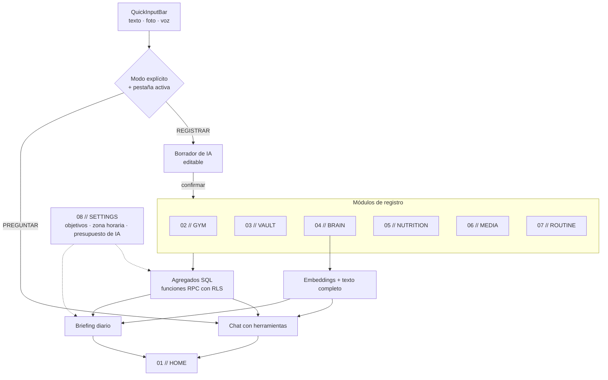
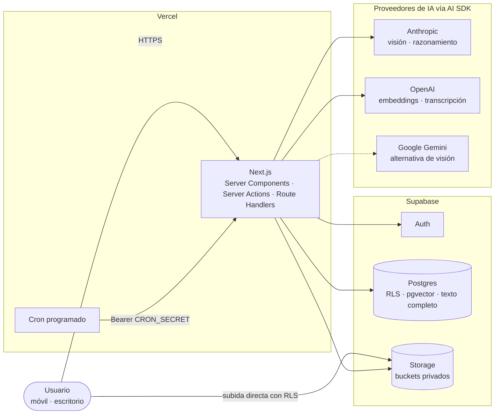
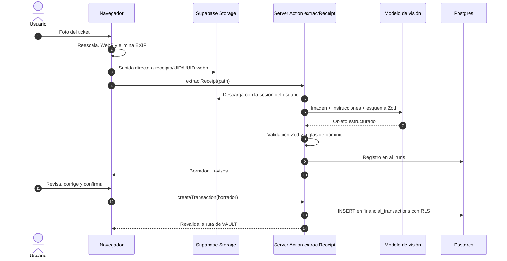
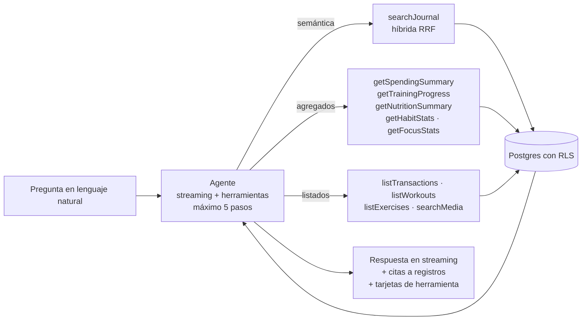
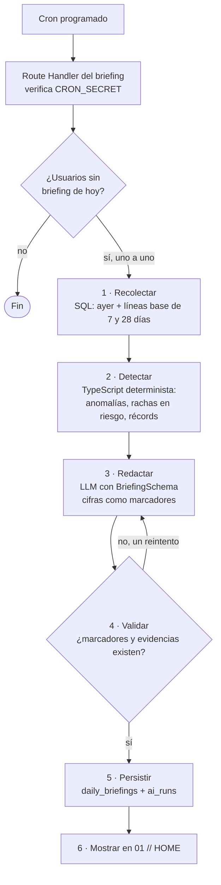
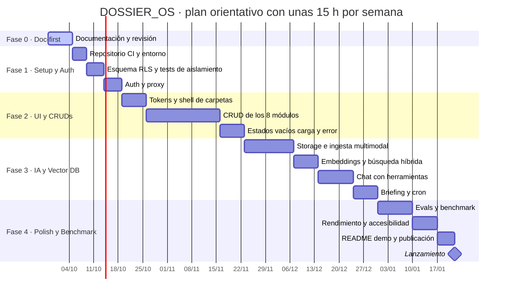

# DOSSIER_OS — Propuesta de producto

> **Documento:** `PROPOSAL.md` · **Versión:** 1.1 · **Estado:** propuesta doc-first (previa al código) · **Fecha:** 2026-09-27
> **Documentos hermanos:** [`DESIGN_SYSTEM.md`](./DESIGN_SYSTEM.md) (identidad, tokens, componentes, motion) · [`ARCHITECTURE.md`](./ARCHITECTURE.md) (esquema SQL, RLS, pipeline de IA, estructura de carpetas)

---

## Índice

1. [Executive Summary & Vision](#1-executive-summary--vision)
2. [Core Feature Breakdown: las 8 pestañas](#2-core-feature-breakdown-las-8-pestañas)
3. [AI Core Architecture](#3-ai-core-architecture)
4. [Tech Stack Justification](#4-tech-stack-justification)
5. [Milestones & Roadmap](#5-milestones--roadmap)
6. [Riesgos y mitigaciones](#6-riesgos-y-mitigaciones)
7. [Plan de benchmark](#7-plan-de-benchmark)
8. [Decisiones abiertas](#8-decisiones-abiertas)
9. [Glosario](#9-glosario)

---

## 1. Executive Summary & Vision

### 1.1 En una frase

**DOSSIER_OS** es un sistema operativo personal que archiva ocho áreas de la vida (entreno, dinero, diario, nutrición, consumo cultural, hábitos y foco, más un inicio y una configuración) en un único archivador digital, y usa IA multimodal para que registrar cueste un gesto y para que los datos de un área expliquen los de otra.

### 1.2 El problema

La vida cuantificada está fragmentada: una app por dominio, cada una con su silo de datos y su propia fricción de registro.

| Síntoma | Consecuencia |
|---|---|
| Registrar exige abrir la app concreta, navegar y teclear | El registro se abandona a las pocas semanas |
| Cada dominio guarda sus datos aparte | El gasto en *delivery* vive lejos del diario donde se anotó el cansancio |
| Ninguna herramienta cruza dominios | «¿Entreno peor las semanas que duermo mal?» exige exportar y cruzar a mano |
| Los datos más sensibles (salud, dinero, pensamientos) quedan repartidos entre terceros | Poca propiedad y ninguna visión de conjunto |

### 1.3 Propuesta de valor

| Pilar | Qué significa | Mecanismo |
|---|---|---|
| **Un gesto para registrar** | Foto, voz o una frase, desde cualquier pestaña | `QuickInputBar` + ingesta multimodal que genera un **borrador confirmable** |
| **Un solo modelo de datos** | Los 8 módulos viven en la misma base de datos | Postgres (Supabase) con RLS; *joins* entre dominios sin integraciones |
| **Respuestas cruzadas** | Preguntas en lenguaje natural sobre cualquier área | Agente con herramientas tipadas + búsqueda híbrida (pgvector + texto completo) |
| **Proactividad** | El sistema habla primero, cada mañana | *Daily Executive Briefing* generado por un flujo programado |
| **Propiedad** | Datos aislados, exportables y borrables | RLS probada con tests, *buckets* privados, exportación completa |

### 1.4 Visión

Un archivador que se ordena solo. La metáfora es literal: cada pestaña es una carpeta de oficina con su índice numérico (`01 // HOME` … `08 // SETTINGS`), cada pantalla es una lámina dentro de esa carpeta y cada lámina tiene una **cifra protagonista** a tamaño de cartel. El lenguaje visual, diseño suizo con actitud brutalista, no es decoración: la jerarquía tipográfica agresiva existe para que la cifra que importa se lea en medio segundo (ver [`DESIGN_SYSTEM.md`](./DESIGN_SYSTEM.md)).

> [!IMPORTANT]
> **«Autonomous» significa aquí autonomía acotada.** El sistema es autónomo para *leer, analizar, programar y proponer*, nunca para escribir datos del usuario sin confirmación. Toda escritura originada por IA pasa por un borrador visible y editable. Es una decisión de producto, no una limitación técnica: en datos de dinero y salud, un error silencioso cuesta más que un toque de confirmación.

### 1.5 Objetivos y no-objetivos

**Objetivos medibles de la v1** (se verifican en la Fase 4, §7):

| ID | Objetivo | Métrica |
|---|---|---|
| O1 | Registrar un gasto desde la foto del ticket | ≤ 10 s de foto a guardado (p50) |
| O2 | Registrar una comida por foto, con ajuste de porción | ≤ 15 s (p50) |
| O3 | Responder preguntas cruzadas con evidencia | ≥ 90 % de citas correctas en el *golden set* |
| O4 | Briefing diario fiable | 30 días seguidos sin fallo de generación |
| O5 | Rendimiento percibido | Core Web Vitals en «bueno» (p75): LCP ≤ 2,5 s · INP ≤ 200 ms · CLS ≤ 0,1 |
| O6 | Coste de IA acotado | Consumo mensual ≤ presupuesto configurado, con corte suave al superarlo |

**No-objetivos de la v1** (decisiones, no olvidos):

- **Sincronización bancaria** (agregadores PSD2): riesgo y complejidad desproporcionados para un proyecto personal. Tickets y entrada manual cubren el caso.
- **Consejo médico o nutricional:** las estimaciones de macros son orientativas y se presentan como tales.
- **Funciones sociales o colaborativas.**
- **App nativa:** web responsive; una PWA instalable queda como extra de la Fase 4.
- **Offline-first.**

### 1.6 Por qué destaca en un portfolio Senior

Un CRUD con un chat no demuestra *seniority*. Lo demuestran las decisiones documentadas, su coste y cómo se miden.

| Señal | Evidencia en el proyecto |
|---|---|
| Criterio de arquitectura | Decisiones registradas con alternativas descartadas (§4.3); herramientas tipadas en lugar de *text-to-SQL*; un solo Postgres para lo relacional, lo vectorial y el texto completo |
| Seguridad multi-tenant real | RLS en todas las tablas con tests automáticos de aislamiento; claves foráneas compuestas contra referencias entre usuarios; secretos solo en servidor |
| IA con ingeniería, no demo | Salidas estructuradas validadas con Zod; *human-in-the-loop*; evals con *golden sets*; coste y latencia trazados por llamada; las cifras del briefing salen de SQL, no del modelo |
| Rendimiento y accesibilidad medidos | Presupuestos de Web Vitals; `prefers-reduced-motion`; modo de colores forzados; navegación completa por teclado |
| Producto con identidad | Un sistema de diseño propio aplicado a una herramienta de uso diario, no a una landing |
| Honestidad técnica | Límites documentados (p. ej. la precisión de la estimación de macros por foto) y medidos en el benchmark |

---

## 2. Core Feature Breakdown: las 8 pestañas

### 2.1 Mapa del sistema

| # | Pestaña | Rol | Cifra protagonista | Entrada con IA | Tablas principales |
|---|---|---|---|---|---|
| 01 | `HOME` | Centro de mando | Fecha del día (`27‘09`) | Briefing, chat | Lee de todas; `daily_briefings` |
| 02 | `GYM` | Entrenamiento | Volumen semanal (kg) | Voz → series | `workouts`, `workout_logs` |
| 03 | `VAULT` | Finanzas | Gasto del mes (€) | Foto de ticket, voz | `financial_transactions` |
| 04 | `BRAIN` | Diario y notas | Racha de escritura (días) | Nota de voz, búsqueda semántica | `notes` |
| 05 | `NUTRITION` | Macros | Kcal restantes hoy | Foto del plato, texto | `macros` |
| 06 | `MEDIA` | Consumo cultural | Terminados este año | Chat sobre reseñas | `media_items` |
| 07 | `ROUTINE` | Hábitos y foco | Racha activa (días) | Voz («hecho: meditar») | `habits`, `habit_logs`, `focus_sessions` |
| 08 | `SETTINGS` | Configuración | Gasto de IA del mes | — | `profiles`, `ai_runs` |

Cómo circulan los datos entre módulos:

### 2.2 La `QuickInputBar`: una sola entrada para todo el sistema

Es el mecanismo que diferencia a DOSSIER_OS de ocho apps pegadas: una barra flotante, siempre presente, que acepta texto, foto o voz. Dos reglas la hacen predecible:

1. **La pestaña activa es el contexto.** Una foto en `03 // VAULT` es un ticket; en `05 // NUTRITION`, un plato. Fuera de esas pestañas, la barra pregunta «¿Ticket o plato?» con dos botones en vez de adivinar.
2. **Dos modos explícitos, `REGISTRAR` y `PREGUNTAR`, no un clasificador.** Un clasificador de intención añade una llamada de IA, latencia y errores a la acción más frecuente del producto. Un conmutador visible cuesta cero y nunca se equivoca.

| Entrada | Pestaña | Interpretación por defecto |
|---|---|---|
| Foto | `VAULT` / `NUTRITION` / otras | Ticket / plato / pregunta al usuario |
| Voz | `BRAIN` | Entrada de diario (+ acciones detectadas en otros módulos) |
| Voz | `GYM` / `ROUTINE` | Series de ejercicio / check-in de hábito |
| Texto en `REGISTRAR` | Cualquiera | Parser del módulo activo («12,40 mercadona» → gasto) |
| Texto en `PREGUNTAR` | Cualquiera | Chat con herramientas sobre todos los módulos |

### 2.3 Detalle por módulo

#### `01 // HOME` — Centro de mando

**Utilidad:** responder «¿cómo voy hoy?» en un vistazo y ser la puerta de entrada de la IA.

- **Daily Executive Briefing** del día (§3.5): titular, de 3 a 5 hallazgos con su evidencia y una acción por hallazgo.
- **Tablero de estado:** una tarjeta por módulo con su cifra protagonista y su desviación frente al objetivo.
- **Pregunta a tu dossier:** chat en lenguaje natural con respuestas citadas (§3.4).
- **Línea de tiempo del día:** todo lo registrado hoy, de cualquier módulo, en orden cronológico.

**Flujo de datos:** `daily_briefings` (una fila por usuario y día) + agregados por módulo (RPC) → Server Components → tarjetas. La interacción con el briefing (leído, útil / no útil) se guarda en `daily_briefings`.

#### `02 // GYM` — Entrenamiento

**Utilidad:** registrar sin fricción entre serie y serie, y ver la progresión real.

- **Sesión activa:** añadir ejercicio y series; botón «repetir última serie»; temporizador de descanso.
- **Registro por voz:** «press banca, cuatro series de ocho a ochenta» → borrador con cuatro series.
- **Progresión por ejercicio:** mejor serie, 1RM estimado (Epley: `peso × (1 + reps / 30)`), volumen (`Σ reps × peso`).
- **Récords personales** detectados al guardar.

**Flujo:** voz o formulario → borrador → `workouts` (sesión) + `workout_logs` (series) → RPC `exercise_progress`.
**Fuera de v1:** plantillas de rutina, grupos musculares, *wearables*.

#### `03 // VAULT` — Finanzas

**Utilidad:** saber a dónde va el dinero con el mínimo esfuerzo de registro.

- **Movimientos** (gasto o ingreso) con categoría, comercio, método de pago y nota.
- **Ticket por foto:** comercio, fecha, total, categoría y **desglose de IVA por tipo** (un ticket de supermercado español puede mezclar 21 %, 10 % y 4 %).
- **Presupuesto mensual** y ritmo de gasto frente al día del mes.
- **Resumen** por categoría y mes.

**Flujo:** foto → Storage `receipts/` → extracción → validación (`Σ bases + Σ cuotas = total ± 0,02 €`) → confirmación → `financial_transactions` (con `receipt_path` y `raw_extraction` para auditoría).
**Fuera de v1:** sincronización bancaria, conversión de divisas, presupuestos por categoría.

#### `04 // BRAIN` — Diario y segundo cerebro

**Utilidad:** un diario consultable por significado, no solo por palabra exacta.

- **Entradas** de texto o voz, con fecha de diario, ánimo (1–5) y etiquetas sugeridas.
- **Nota de voz:** transcripción literal + título + etiquetas + ánimo sugerido; el audio original se conserva.
- **Búsqueda híbrida:** semántica (pgvector) + texto completo en español, fusionadas por rango (RRF).
- **Relacionadas:** notas cercanas por similitud vectorial.
- **Acciones detectadas:** «he gastado 20 € en gasolina» dentro de una nota genera un borrador de gasto que se confirma con un toque.

**Flujo:** texto o voz → `notes` → *después de responder al usuario*, se calcula el embedding; la columna de texto completo es generada por Postgres.

#### `05 // NUTRITION` — Macros

**Utilidad:** llevar kcal y macros sin pesar ni buscar cada alimento.

- **Comida por foto:** alimentos identificados, porción estimada y macros por elemento → borrador con porciones ajustables.
- **Comida por texto:** «200 g de pechuga con arroz».
- **Objetivos diarios** (kcal, proteína, carbohidratos, grasa) definidos en `SETTINGS`; progreso del día.
- **Coherencia energética:** las kcal se recalculan con los factores de Atwater (4 / 4 / 9 kcal por gramo) y se avisa si la discrepancia con la estimación supera el 15 %.

> [!WARNING]
> **Límite honesto:** una foto no muestra el aceite, las salsas ni el peso real. La estimación se presenta con su confianza visible y se confirma siempre. El benchmark (§7) mide el error real en lugar de prometer una cifra.

#### `06 // MEDIA` — Consumo cultural

**Utilidad:** un registro único de lo que se lee, ve, escucha y juega.

- **Fichas:** libro, película, serie, podcast, videojuego o álbum; estado (pendiente, en curso, terminado, abandonado); valoración 1–10; progreso; reseña.
- **Vistas:** en curso, pendientes, terminados por año.
- **Preguntas cruzadas** vía chat: «¿qué libros valoré mejor este año y qué tenían en común?».

**Fuera de v1:** metadatos automáticos (TMDB, Open Library) y recomendaciones.

#### `07 // ROUTINE` — Hábitos y foco

**Utilidad:** sostener hábitos y medir el tiempo de trabajo profundo.

- **Hábitos** diarios o semanales con objetivo por periodo; check-in de un toque; rachas.
- **Sesiones de foco** (temporizador tipo Pomodoro) con etiqueta, interrupciones y duración real.
- **Estadísticas:** cumplimiento semanal y minutos de foco por día.

**Flujo:** check-in → `habit_logs` (único por hábito y día); temporizador → `focus_sessions`.

> [!NOTE]
> El «día» es siempre el **día local del usuario** (`profiles.timezone`), nunca el `current_date` del servidor, que corre en UTC. Un check-in a las 00:30 en Madrid pertenece a ese día, no al anterior.

#### `08 // SETTINGS` — Configuración

- **Perfil:** nombre, zona horaria, moneda.
- **Objetivos:** macros diarios y presupuesto mensual.
- **IA:** presupuesto mensual de IA, consumo del mes (leído de `ai_runs`), activar o desactivar el briefing. La hora del briefing es fija en la v1 (§8).
- **Accesibilidad:** activar o desactivar los atajos de una sola tecla (`1`–`8`, `/`).
- **Datos:** exportación completa (JSON + CSV por módulo) y borrado de cuenta en cascada.
- **Seguridad:** cierre de todas las sesiones.

---

## 3. AI Core Architecture

### 3.1 Principios

1. **Borrador antes que escritura.** Ninguna salida de un modelo toca una tabla de dominio sin pasar por un borrador que se ve y se edita.
2. **Herramientas tipadas, nunca SQL generado.** El modelo invoca funciones con parámetros validados por Zod, que ejecutan RPC con la sesión del usuario (y por tanto con RLS). Un modelo que escribe SQL es una superficie de inyección.
3. **Cifras desde los datos, prosa desde el modelo.** En el briefing, el modelo escribe marcadores (`{{vault.spend_mtd}}`) y la interfaz pinta el valor calculado en SQL. Un número que el modelo no puede escribir es un número que no puede inventar.
4. **Mínimo privilegio.** Las rutas interactivas usan la sesión del usuario. Solo el job programado usa la clave secreta de Supabase, y filtra por `user_id` de forma explícita.
5. **Todo se mide.** Cada llamada queda en `ai_runs` (tarea, modelo, tokens, latencia, coste estimado, resultado).
6. **Degradación elegante.** Sin IA, por caída o por presupuesto agotado, todo sigue funcionando de forma manual.

### 3.2 Vista de sistema

### 3.3 Ingesta multimodal

Tres canales, un mismo patrón: **subir → extraer → validar → borrador → confirmar → guardar**.

| Canal | Entrada | Preproceso en cliente | Modelo | Esquema de salida | Validación de dominio | Destino |
|---|---|---|---|---|---|---|
| Ticket | Foto | Reescalado, WebP, **EXIF eliminado** | Visión | `TicketExtractionSchema` | `Σ bases + Σ cuotas = total`; fecha no futura | `financial_transactions` |
| Plato | Foto | Igual | Visión | `MealExtractionSchema` | Atwater ±15 %; porciones > 0 | `macros` |
| Voz | Audio (`MediaRecorder`) | Límite de duración | Transcripción + estructuración | `VoiceNoteSchema` | Transcripción no vacía | `notes` (+ borradores en otros módulos) |

Tres restricciones que dan forma al diseño:

- **Los archivos no pasan por la función.** Una foto de móvil pesa varios MB, y ni el cuerpo de una Server Action ni el de una función serverless están pensados para eso (límites concretos en `ARCHITECTURE.md` §3). El navegador sube directo a Storage, con RLS por carpeta de usuario, y la acción recibe solo la ruta.
- **Privacidad por defecto.** Recodificar la imagen en un `canvas` elimina los metadatos EXIF, incluida la geolocalización, antes de que la foto salga del dispositivo.
- **Claude no transcribe audio ni genera embeddings.** Según la documentación de la API consultada, Claude acepta texto, imágenes y PDF, pero no audio, y Anthropic no ofrece un endpoint de embeddings. Por eso la transcripción y los embeddings van a otro proveedor. Es una de las razones para usar el AI SDK (§4).

Secuencia del canal más exigente, el ticket:

### 3.4 RAG cruzado

El diferenciador es responder preguntas que atraviesan módulos. La trampa habitual es resolverlo todo con embeddings, y no funciona:

| Tipo de pregunta | Ejemplo | Por qué no basta un vector | Mecanismo |
|---|---|---|---|
| Agregado numérico | «¿Cuánto gasté en restaurantes en agosto?» | Una búsqueda por similitud no suma | Herramienta `getSpendingSummary` → RPC SQL |
| Recuerdo semántico | «¿Qué escribí cuando me lesioné la rodilla?» | — (aquí sí) | `searchJournal` → búsqueda híbrida (vector + texto completo, RRF) |
| Cruce de dominios | «¿Duermo peor cuando entreno tarde?» | Requiere unir horas de entreno con menciones al sueño | El agente combina `listWorkouts` (horas de inicio) + `searchJournal` (sueño) y razona |
| Temporal relativo | «¿Y el mes pasado?» | «el mes pasado» depende de hoy y de la zona horaria | Fecha y zona horaria en el *system prompt*; las herramientas reciben fechas ISO |

Por eso «RAG cruzado» se implementa como **recuperación aumentada por herramientas**: un agente con un límite de pasos elige entre herramientas semánticas (sobre `notes`) y herramientas SQL (sobre el resto), todas de solo lectura y todas ejecutadas con RLS.

Las respuestas no son solo texto: cada resultado de herramienta se pinta como una tarjeta del sistema de diseño (un mini gráfico de gasto, una lista de notas citadas) y cada cita enlaza al registro en su pestaña.

### 3.5 Proactive Background Agent: Daily Executive Briefing

Cada mañana (en la v1, a las 05:00 UTC: las 07:00 en Madrid en verano), el sistema genera un informe ejecutivo del día anterior y de la tendencia. Se implementa como **flujo de trabajo con un paso de LLM**, no como un agente libre: la recogida de datos es determinista (más barata, testeable y sin cifras inventadas) y el modelo solo redacta y prioriza.

| Propiedad | Diseño |
|---|---|
| Idempotencia | Clave única `(user_id, briefing_date)`: reejecutar el cron no duplica |
| Anti-alucinación | Marcadores de métricas validados contra el conjunto calculado; un marcador inexistente invalida el hallazgo |
| Interactividad | Cada hallazgo trae una acción: abrir el registro, prellenar la `QuickInputBar` o «preguntar por qué», que abre el chat con la evidencia como contexto |
| Aprendizaje ligero | Valoración útil / no útil por hallazgo; en v2, los mejor valorados sirven de ejemplos al redactor |
| Fallo | Si falla dos veces, `HOME` muestra el tablero sin briefing y el error queda en `ai_runs`; el sistema nunca bloquea por la IA |

### 3.6 Enrutado de modelos

El modelo de cada tarea vive en un único registro (`lib/ai/models.ts`), así que cambiarlo es una línea. Los valores por defecto:

| Tarea | Modelo por defecto | Alternativa documentada | Motivo |
|---|---|---|---|
| Visión: tickets y platos | Claude Opus 5 (`claude-opus-5`), esfuerzo bajo | Gemini Flash | El eval de la Fase 4 decide con datos: precisión × coste × latencia en tickets españoles |
| Estructuración de notas de voz | Claude Opus 5, esfuerzo bajo | — | Extracción de título, ánimo, etiquetas y acciones |
| Transcripción | OpenAI `gpt-4o-mini-transcribe` | Gemini (audio nativo) | Claude no acepta audio; acepta WebM (Chrome, Firefox) y MP4 (Safari), los formatos de `MediaRecorder` |
| Embeddings | OpenAI `text-embedding-3-small` (1536 dim.) | Gemini con salida truncada a 1536 | Coincide con la columna `vector(1536)` sin truncar |
| Chat con herramientas | Claude Opus 5, esfuerzo medio | — | Uso de herramientas y razonamiento cruzado |
| Briefing diario | Claude Opus 5, esfuerzo alto | — | Una llamada al día: la calidad pesa más que el coste |

**Orden de magnitud del coste** con estos valores por defecto y tarifas de lista de Anthropic (USD por millón de tokens de entrada / salida: Opus 5, 5 / 25; Sonnet 5, 2 / 10; Haiku 4.5, 1 / 5; caché de junio de 2026, verificar antes de presupuestar):

| Operación | Tokens aprox. (entrada / salida, incl. razonamiento) | Coste aprox. |
|---|---|---|
| Ticket o plato | 3,4 k / 0,8 k | ~0,04 USD |
| Nota de voz (estructuración) | 1,3 k / 0,7 k | ~0,02 USD |
| Pregunta al chat (3 pasos) | 16 k / 2,5 k | ~0,14 USD |
| Briefing | 6 k / 4 k | ~0,13 USD |

Con un uso diario intenso (2 tickets, 3 comidas, 1 nota de voz, 4 preguntas y el briefing) salen unos **0,9 USD/día, del orden de 25 USD/mes**, y el chat es cerca del 60 %. Las palancas, en orden: caché de prompts del prefijo estable (*system prompt* + definiciones de herramientas), esfuerzo ajustado por ruta, límite de pasos del agente y, solo si el eval demuestra que la calidad se mantiene, un modelo más barato por ruta. Esa última es una decisión del autor tras medir (§8), no un valor por defecto.

### 3.7 Seguridad y privacidad de la IA

| Riesgo | Mitigación |
|---|---|
| *Prompt injection* desde un ticket o una nota («ignora tus instrucciones y…») | El texto extraído y las notas son datos, nunca instrucciones; las herramientas del chat son de solo lectura; toda escritura pasa por la interfaz de confirmación |
| Fuga entre usuarios | Las herramientas ejecutan RPC con la sesión del usuario → RLS; el job programado filtra por `user_id` y tiene tests propios |
| Datos sensibles en imágenes | EXIF eliminado en cliente; *buckets* privados; URLs firmadas de vida corta |
| Datos en proveedores | `ai_runs` guarda metadatos, no contenido; revisar y documentar la política de retención de cada proveedor antes de usar datos reales |
| Abuso o bucle de coste | Presupuesto mensual por usuario, límite de pasos por conversación y de mensajes por petición |

### 3.8 Evaluación

La IA se trata como cualquier dependencia no determinista: con conjuntos de prueba versionados en el repositorio.

| Suite | Tamaño | Métricas |
|---|---|---|
| Tickets reales anonimizados | 30 | Exactitud por campo (total, fecha, comercio, categoría, desglose de IVA) |
| Platos con referencia pesada | 20 | Error absoluto medio en kcal y proteína; % dentro de ±20 % |
| Preguntas cruzadas | 30 | Corrección de la respuesta (juez LLM + revisión manual) y precisión de citas |
| Briefings | 14 días | Rúbrica: cifras correctas, relevancia, accionabilidad |

Los evals cuestan dinero, así que no corren en cada *push*: se lanzan a mano o cada noche, y cada cambio de prompt o de modelo exige una ejecución antes de fusionarse.

---

## 4. Tech Stack Justification

### 4.1 Tabla de decisiones

| Capa | Elección | Por qué | Alternativas descartadas |
|---|---|---|---|
| Framework | **Next.js 16** (App Router, Turbopack) | Server Components para leer los datos de cada pestaña en servidor sin API intermedia; Server Actions para mutaciones tipadas; *streaming* para el chat; `after()` para trabajo posterior a la respuesta (embeddings) | React Router 7 (válido, peor integración con Vercel y el AI SDK); SPA con Vite (sin RSC ni *streaming* de servidor) |
| UI | **React 19.3** | `useOptimistic` y `useActionState` para formularios con Server Actions; `<ViewTransition>` estable desde 19.3 para el cambio de lámina entre pestañas, ejecutado por el navegador | — |
| Estilos | **Tailwind CSS v4** | Configuración CSS-first con `@theme`: los tokens del sistema son variables CSS nativas; *container queries* integradas; sin runtime | CSS-in-JS con runtime (coste en RSC); CSS Modules (sin sistema de tokens compartido) |
| Motion | **Motion** (antes Framer Motion, `motion/react`) | Springs físicos interrumpibles para todo lo que responde al puntero o al dedo (pestañas, barra de entrada, borradores, arrastre), `AnimatePresence`, animaciones de layout; carga diferida con `LazyMotion` | Solo CSS (sin springs interrumpibles ni presencia); GSAP (imperativo, no aporta sobre el modelo declarativo aquí) |
| Backend | **Supabase**: Postgres + Auth + RLS + Storage + pgvector | Un único Postgres para datos relacionales, vectores y texto completo: *joins* entre dominios, una sola política de seguridad (RLS) y ninguna sincronización con una base vectorial externa | Pinecone o Weaviate (segunda fuente de verdad, sin RLS); Firebase (documental, agregados pobres) |
| IA | **Vercel AI SDK 7** | API unificada multiproveedor (necesaria: Claude no cubre audio ni embeddings); salidas estructuradas con Zod; *tool calling*; *streaming* a la UI con `useChat`; telemetría | SDKs nativos por proveedor (tres integraciones distintas); LangChain (abstracción pesada para este alcance) |
| Validación | **Zod 4** | Un esquema = tipo TypeScript + validación en runtime + JSON Schema para el modelo | Valibot (menos soporte en el AI SDK) |
| Hosting | **Vercel** | Integración nativa con Next.js, cron, `waitUntil` para `after()` | Self-hosting (operación innecesaria para un proyecto personal) |
| Calidad | Vitest · Playwright · pgTAP · evals propios | Unidad, extremo a extremo, **RLS probada en SQL** e IA medida | — |

> [!NOTE]
> **Contrapartida asumida del AI SDK.** Las funciones nuevas de cada proveedor (niveles de esfuerzo de Claude, salidas estructuradas nativas, *fallbacks* del servidor) llegan al SDK con cierto retraso y a través de `providerOptions`. Se mitiga aislando toda llamada a modelos en `lib/ai/` y fijando versiones.

### 4.2 Versiones

Las versiones exactas se fijan en `package.json` al crear el proyecto y se documentan en [`ARCHITECTURE.md`](./ARCHITECTURE.md) §0. La regla: majors estables actuales en la fecha de arranque, actualización en ventanas planificadas, nunca en mitad de una fase.

### 4.3 Registro de decisiones (resumen)

| ADR | Decisión | Razón principal |
|---|---|---|
| 001 | Next.js 16, no 15 | Next.js 16 es la major estable actual (16.3 a 2026-09-27). Empezar en 15 obliga a migrar enseguida: `middleware.ts` queda obsoleto en favor de `proxy.ts`, el acceso síncrono a `cookies()`, `headers()`, `params` y `searchParams` desaparece, `next lint` se elimina y Turbopack pasa a ser el *bundler* por defecto |
| 002 | Un solo Postgres para relacional + vectorial + texto completo | Consultas cruzadas y RLS única; a esta escala (miles de filas por usuario) pgvector con HNSW sobra |
| 003 | Herramientas tipadas en lugar de *text-to-SQL* | Seguridad (sin SQL arbitrario), testabilidad y resultados predecibles |
| 004 | Borrador confirmable para toda escritura de IA | Coste del error asimétrico en dinero y salud |
| 005 | Briefing como flujo determinista + un paso de LLM | Coste, testabilidad y cifras que no se pueden inventar |
| 006 | Subida directa a Storage, no a través de funciones | Límites de tamaño del cuerpo de las peticiones; menos latencia y menos coste de cómputo |
| 007 | Modos `REGISTRAR` / `PREGUNTAR` explícitos | Predecible, sin coste ni latencia de un clasificador |

---

## 5. Milestones & Roadmap

Supuesto de planificación: **dedicación parcial, unas 15 h/semana**. Las fechas son orientativas; lo que no se negocia son los criterios de salida de cada fase.

### Fase 1 — Setup & Auth

**Objetivo:** un esqueleto desplegado, seguro y con la base de datos definitiva.

- Repositorio propio en GitHub; Next.js 16 + TypeScript `strict` + Tailwind v4; *linting* y formato; CI (tipos, lint, tests) y *preview deployments*.
- Proyecto de Supabase; migraciones versionadas con la CLI (`supabase/migrations`).
- Esquema completo, RLS y funciones de [`ARCHITECTURE.md`](./ARCHITECTURE.md) §1–§2.
- Auth con enlace mágico y Google OAuth; refresco de sesión en `proxy.ts`; grupo de rutas protegido.

**Criterios de salida:** un test automático demuestra que el usuario A no puede leer, escribir ni referenciar filas del usuario B en ninguna tabla · CI en verde · despliegue de *preview* funcionando.

> [!NOTE]
> **Estado a 2026-09-27.**
>
> - **Cumplido:** el aislamiento pasa 64 de 64 en local, en la CI y en el proyecto remoto ([`ARCHITECTURE.md`](./ARCHITECTURE.md) §2.3), y la CI está en verde.
> - **Aplazado por decisión del autor:** el despliegue de *preview*. Vercel se conecta al final del proyecto.
> - **Consecuencia:** el criterio de salida de la Fase 3 («briefing generado 7 días seguidos») necesita el cron de Vercel, así que exige haber desplegado para entonces.

### Fase 2 — UI Folder Tabs & CRUDs

**Objetivo:** los 8 módulos usables a mano, con la identidad visual completa.

- Tokens de diseño y *shell*: `FolderTabs`, `BrutalistCard`, `DisplayNumeral`, transición de láminas, `QuickInputBar` (solo texto).
- CRUD por módulo con Server Actions + Zod + UI optimista.
- Estados vacíos, de carga (Suspense) y de error en cada pestaña.

**Criterios de salida:** las 8 pestañas navegables solo con teclado · 0 violaciones graves o críticas de axe · CLS < 0,1 e INP < 200 ms en un móvil de gama media.

### Fase 3 — Integración de IA & Vector DB

**Objetivo:** la capa que convierte el CRUD en un sistema operativo.

- *Buckets* y políticas de Storage; canales de ticket, plato y voz con borrador confirmable.
- Embeddings (después de responder) y búsqueda híbrida.
- Chat con herramientas y tarjetas de resultado.
- Briefing diario con cron.
- `ai_runs` y presupuesto mensual por usuario.

**Criterios de salida:** línea base de los evals registrada · respuestas del chat con citas verificables · briefing generado 7 días seguidos sin intervención.

### Fase 4 — Polishing & Benchmark

**Objetivo:** demostrar con números lo que la propuesta afirma.

- Ejecución completa de los evals (§3.8) y del plan de benchmark (§7).
- Rendimiento: análisis del *bundle*, `LazyMotion`, imágenes, *streaming*.
- Accesibilidad: auditoría con lector de pantalla, movimiento reducido, colores forzados.
- Observabilidad: trazas de las llamadas de IA y registro de errores.
- Publicación: README con diagramas, `docs/BENCHMARK.md`, vídeo de demo y cuenta de demostración con **datos sintéticos etiquetados como tales**.

**Criterios de salida:** `BENCHMARK.md` publicado con cada objetivo de §1.5 cumplido o con su desviación explicada.

### Calendario orientativo

**Camino crítico:** esquema + RLS (F1) → shell de carpetas (F2) → Storage e ingesta (F3) → evals (F4). El chat y el briefing dependen de que existan datos reales en los módulos, por eso van al final de la Fase 3.

---

## 6. Riesgos y mitigaciones

| Riesgo | Prob. | Impacto | Mitigación |
|---|---|---|---|
| Alcance: 8 módulos + IA para una sola persona | Alta | Alto | v1 recortada por módulo (§2.3, «fuera de v1»); la Fase 2 entrega valor sin IA |
| Coste de IA descontrolado | Media | Medio | Presupuesto mensual con corte suave; esfuerzo por ruta; caché de prompts; límite de pasos |
| Cifras alucinadas en el briefing | Media | Alto | Marcadores de métricas validados; números pintados desde SQL |
| Extracciones erróneas guardadas como verdad | Media | Alto | Borrador confirmable; confianza visible; `raw_extraction` para auditar |
| Inyección de instrucciones vía OCR o notas | Baja | Alto | Herramientas de solo lectura; escritura solo con confirmación |
| Fuga de datos entre usuarios | Baja | Crítico | RLS en todas las tablas + tests pgTAP en CI + FKs compuestas |
| Cambios de API en Next.js, el AI SDK o Supabase | Media | Medio | Versiones fijadas; IA aislada en `lib/ai/`; actualizaciones en ventanas planificadas |
| Estimación de macros por foto poco precisa | Alta | Medio | Presentada como estimación; porción editable; error medido y publicado |
| Dependencia de un proveedor de IA | Media | Medio | AI SDK + registro de modelos: cambiar de proveedor es una línea y una ejecución del eval |

---

## 7. Plan de benchmark

Lo que se publicará en `docs/BENCHMARK.md` al cerrar la Fase 4. Los umbrales son **hipótesis a validar**, no resultados.

| Área | Métrica | Umbral objetivo | Cómo se mide |
|---|---|---|---|
| Tickets | Exactitud de total / fecha / comercio | ≥ 95 % / ≥ 95 % / ≥ 90 % | Suite de 30 tickets reales anonimizados |
| Tickets | Desglose de IVA correcto | ≥ 80 % | Misma suite |
| Platos | Kcal dentro de ±20 % de la referencia pesada | Se fija tras la primera medición | Suite de 20 platos pesados |
| Chat | Respuestas correctas / citas correctas | ≥ 80 % / ≥ 90 % | 30 preguntas con respuesta de referencia |
| Latencia | Extracción de ticket (p95) | < 8 s | `ai_runs.latency_ms` |
| Latencia | Primer token del chat (p95) | < 3 s | Trazas |
| Web | LCP / INP / CLS (p75) | ≤ 2,5 s / ≤ 200 ms / ≤ 0,1 | Lighthouse CI + RUM (Vercel Speed Insights) |
| Coste | USD por operación y por mes | Dentro del presupuesto configurado | `ai_runs.cost_usd` |
| Seguridad | Tablas con RLS / tests de aislamiento | 100 % / 100 % en verde | pgTAP en CI |

---

## 8. Decisiones abiertas

| Decisión | Opciones | Cómo se decide |
|---|---|---|
| Proveedor de visión | Claude Opus 5 · Gemini Flash | Eval de tickets y platos: precisión × coste × latencia |
| Modelo por ruta | Opus 5 en todas · Sonnet 5 o Haiku 4.5 en extracción | Decisión del autor tras el eval; el valor por defecto no baja por coste sin datos |
| Tipografía de display | Space Grotesk (libre) · Helvetica Now Display (licencia comercial) | Presupuesto de licencia; ver `DESIGN_SYSTEM.md` §3 |
| Programación del briefing | Cron diario de Vercel · `pg_cron` horario en Supabase | Diario basta con una zona horaria; horario si hay usuarios en varias zonas |
| PWA y notificaciones | Sí · No en v1 | Margen al final de la Fase 4 |

---

## 9. Glosario

| Término | Definición |
|---|---|
| **RLS** | *Row Level Security*: políticas de Postgres que filtran filas por usuario en la propia base de datos |
| **RSC** | *React Server Components*: componentes que se ejecutan solo en el servidor y leen datos directamente |
| **Server Action** | Función de servidor invocable desde un formulario o un componente cliente, con validación y revalidación |
| **pgvector / HNSW** | Extensión de Postgres para vectores; HNSW es su índice de vecinos aproximados en grafo |
| **RRF** | *Reciprocal Rank Fusion*: fusión de rankings (semántico y texto completo) por la inversa de la posición |
| **Human-in-the-loop** | Una persona confirma la salida del modelo antes de que tenga efectos |
| **Golden set** | Conjunto de casos con respuesta de referencia, versionado, para medir regresiones |
| **e1RM** | 1RM estimado: peso máximo teórico a una repetición, calculado con la fórmula de Epley |
| **Atwater** | Factores de energía por macronutriente: 4 kcal/g (proteína, carbohidratos) y 9 kcal/g (grasa) |
